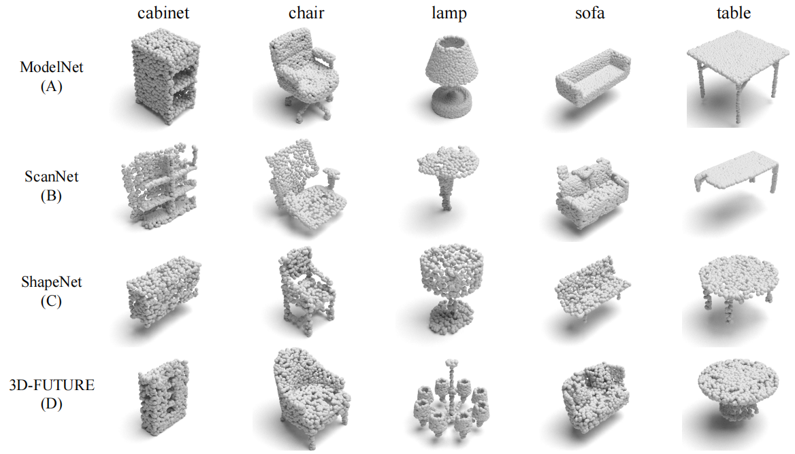

# PointDGMamba: Domain Generalization of Point Cloud Classification via Generalized State Space Model

Our code is coming soon.

## 1.Overview


## 2. PointDG-3to1 benchmark

We propose a multi-domain generalization benchmark named PointDG-3to1 consisting of four sub-datasets. 

### Number


### Visualization



## 3.Performance


## Cite

If you use PointDGMamba in your research, please use the following BibTeX entry.

```
@article{yang2024pointdgmamba,
      title={PointDGMamba: Domain Generalization of Point Cloud Classification via Generalized State Space Model}, 
      author={Hao Yang and Qianyu Zhou and Haijia Sun and Xiangtai Li and Fengqi Liu and Xuequan Lu and Lizhuang Ma and Shuicheng Yan},
      journal={arXiv preprint arXiv:2408.13574},
      year={2024}
}
```

